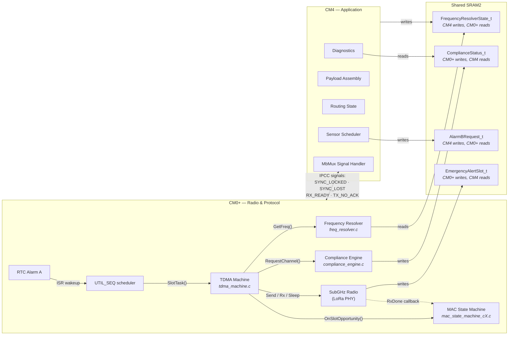

# System Overview

> What lives on which core, what calls what, and where data crosses the inter-core boundary.

## How to Read This

1. **Start at RTC Alarm A** (top-left): every slot begins with an interrupt
2. **Follow the arrows down** through TDMA Machine — it orchestrates each slot
3. **Three queries per slot**: frequency lookup, MAC decision, compliance gate
4. **Radio action**: the result of the MAC decision (TX, RX, or Sleep)
5. **Dashed arrow**: asynchronous radio callbacks feed back into the MAC
6. **Shared SRAM2** (center): strict single-writer ownership, no mutexes
7. **IPCC signals** (thick arrow): event notifications from CM0+ to CM4
