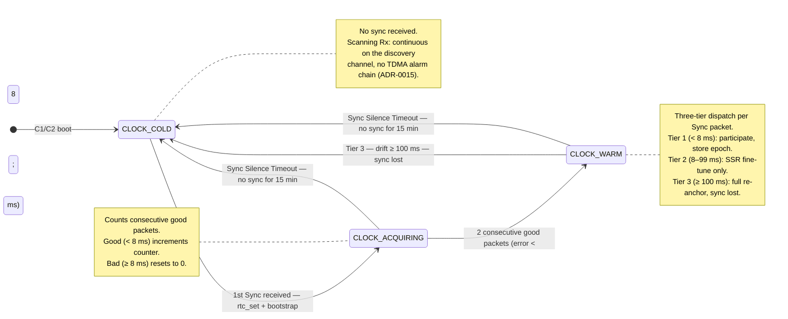
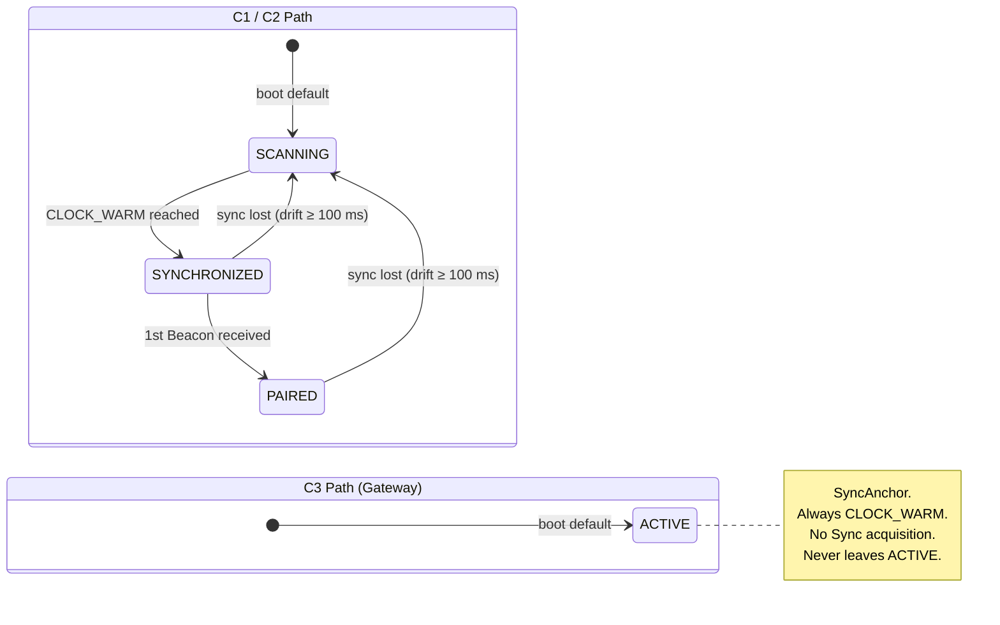
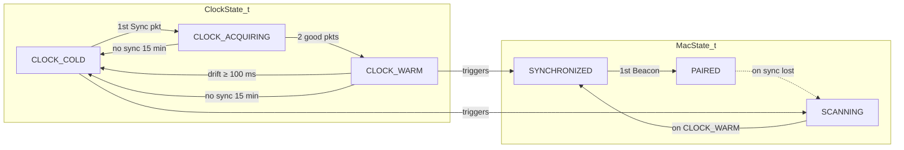

# MAC + Clock State Machine

> Clock quality drives MAC state transitions. Two coupled FSMs with a three-tier sync dispatch.

## Clock State Machine (ClockState_t)

Tracks RTC synchronisation quality. Drives the MAC state transitions for C1 and C2 nodes.

## MAC State Machine (MacState_t)

Operational state driven by Clock transitions and Beacon reception.

## How Clock Drives MAC

## Three-Tier Sync Dispatch (CLOCK_WARM)

When a node is fully synchronised, each incoming Sync packet is classified by clock error:

| Tier | Error Range | Action | Effect |
|------|-------------|--------|--------|
| **1** | < 8 ms | Participate | Store epoch for relay (C2 sets `s_epoch_received_this_phase = true`) |
| **2** | 8–99 ms | SSR correction | `rtc_align_subsecond()` — fine-tune without relay |
| **3** | ≥ 100 ms | Full re-anchor | `rtc_set()` → `trigger_sync_lost()` → back to SCANNING |

## Key Thresholds

| Constant | Value | Purpose |
|----------|-------|---------|
| `SYNC_PARTICIPATE_THRESHOLD_MS` | 8 ms (0.25·T_S) | Below this: clock is good enough to participate |
| `SYNC_RESYNC_THRESHOLD_MS` | 100 ms (3·T_S) | Above this: clock has drifted too far, full re-sync |
| `SYNC_LOCK_THRESHOLD_MS` | 16 ms (0.5·T_S) | CT drift budget for pure CT model (deferred); not used in current relay model |
| `SYNC_SILENCE_TIMEOUT_MS` | 15 min (provisioned) | Wall-clock timeout with no Sync packet received → `CLOCK_COLD`. Decoupled from TDMA table. See ADR-0013. |
