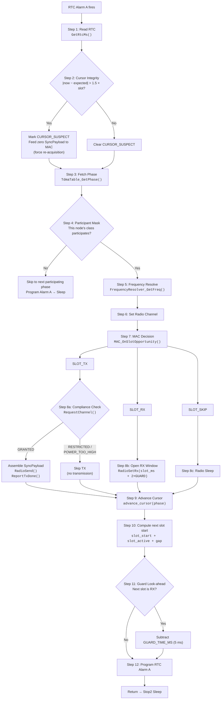
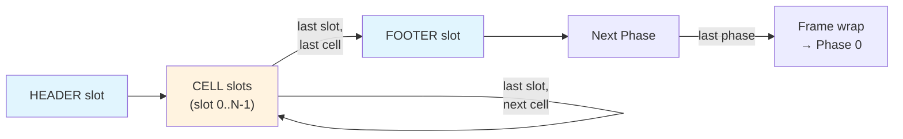

# TDMA Slot Execution Flow

> The firmware heartbeat: every RTC Alarm A wake executes this exact pipeline in `TdmaMachine_SlotTask()`.

## Cursor Advancement Logic

The TDMA Machine maintains a `FrameCursor_t {phase_index, cell_index, slot_index}` that traverses the schedule:

## Key Constants

| Constant | Value | Used In |
|----------|-------|---------|
| `GUARD_TIME_MS` | 5 ms | RX slots wake early to catch preamble |
| `TX_POWER_DBM` | 14 dBm | Compliance Engine power check |
