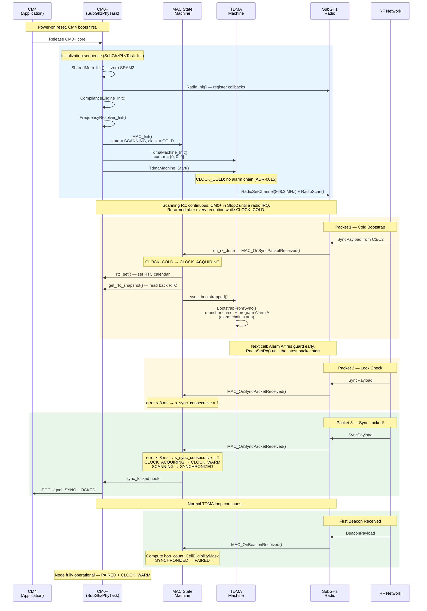

# Boot to Operational Sequence

> How a C1/C2 node goes from power-on to fully paired. Shows initialization order and the three-packet Sync lock.

## Timeline Summary

| Step | Event | Clock State | MAC State |
|------|-------|-------------|-----------|
| Boot | `MAC_Init()` | COLD | SCANNING |
| Sync Pkt 1 | RTC set + cursor bootstrap | ACQUIRING | SCANNING |
| Sync Pkt 2 | Error < 8 ms, counter = 1 | ACQUIRING | SCANNING |
| Sync Pkt 3 | Error < 8 ms, counter = 2 | **WARM** | **SYNCHRONIZED** |
| Beacon | Hop count + eligibility mask | WARM | **PAIRED** |

## C3 (Gateway) Difference

C3 skips this entire sequence. It boots directly into `MAC_STATE_ACTIVE` with `CLOCK_WARM` and immediately begins transmitting Sync packets as the SyncAnchor.
