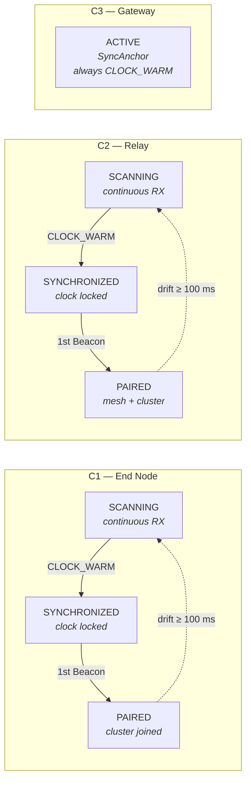
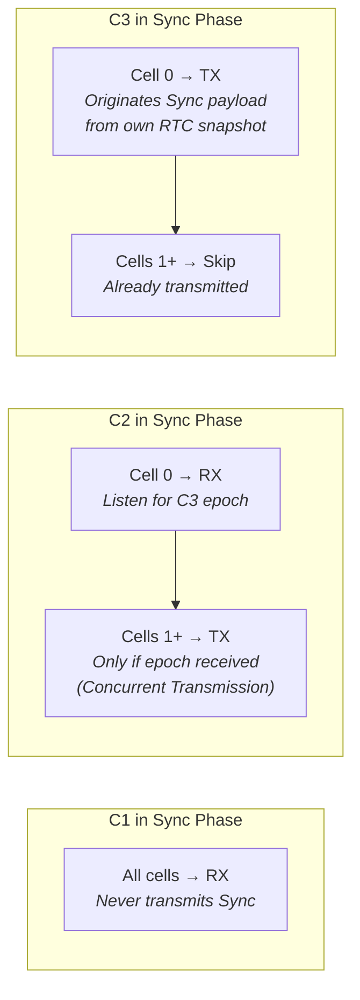

# Node Class Comparison: C1 vs C2 vs C3

> Same `mac_state_machine.h` interface, radically different behavior. One `.c` file per class, selected at link time.

## Behavioral Comparison

| Behavior | C1 (End Node) | C2 (Relay) | C3 (Gateway) |
|----------|---------------|------------|---------------|
| **Boot MAC state** | SCANNING | SCANNING | ACTIVE |
| **Boot clock state** | CLOCK_COLD | CLOCK_COLD | always CLOCK_WARM |
| **Sync phase TX** | Never (always RX) | Cell 0: RX; Cells 1+: TX if epoch received | Always TX every cell |
| **Sync relay** | No | Yes — stores C3 epoch, relays in cells 1+ | Originates epoch |
| **Beacon TX** | Never | Yes, gated by BeaconTxBudget | Always TX first K cells |
| **BeaconTxBudget** | N/A | Tracked; reset to 2 on structural change | Bypassed |
| **Sync acquisition** | Full 3-packet lock + 3-tier dispatch | Full 3-packet lock + 3-tier dispatch + epoch storage | No-op (ignored) |
| **MAC_GetClockState()** | Returns actual state | Returns actual state | Always returns CLOCK_WARM |

## State Machine Progression per Class



## Sync Phase Behavior

How each class behaves during the Sync Phase (`DIRECTION_MAC_CELL`):



## Slot Decision Logic per Direction Mode

| Direction Mode | C1 Decision | C2 Decision | C3 Decision |
|----------------|-------------|-------------|-------------|
| `DIRECTION_CELL_SKIP` | hop-count mod-3 eligibility | hop-count mod-3 eligibility | eff_hop=3, mod-3 eligibility |
| `DIRECTION_MAC_CELL` (Mesh_Beacon) | Always RX | TX if cell < K and budget > 0 | TX if cell < K (no budget check) |
| `DIRECTION_MAC_CELL` (Sync) | All cells: RX | Cell 0: RX; Cells 1+: TX if epoch received | Cell 0: TX; Cells 1+: Skip |
| `DIRECTION_MAC_PHASE` | *unused* | *unused* | *unused* |

## Link-Time Polymorphism

```
mac_state_machine.h          (shared interface — all three classes)
       │
       ├── mac_state_machine_c1.c   (linked in C1 firmware image)
       ├── mac_state_machine_c2.c   (linked in C2 firmware image)
       └── mac_state_machine_c3.c   (linked in C3 firmware image)
```

Only one `.c` file is compiled per firmware binary. The compiler eliminates dead code paths for other classes via the `NODE_CLASS` compile-time constant.
