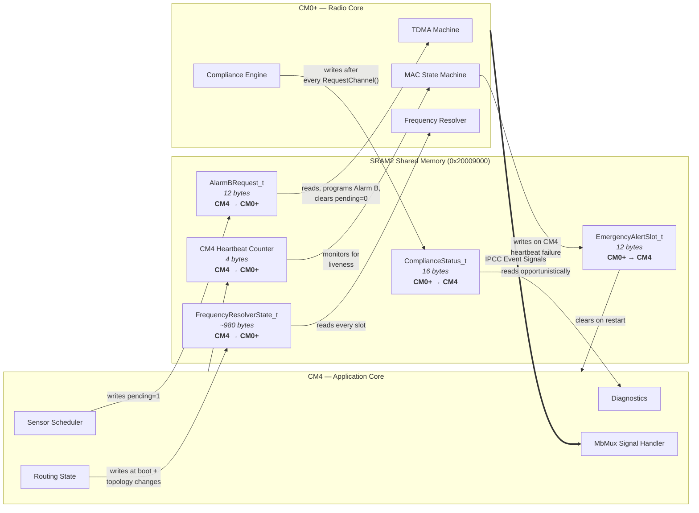
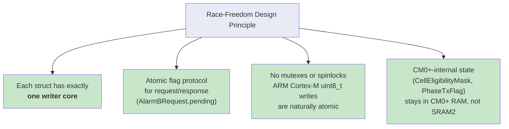

# Inter-Core Communication

> Strict single-writer ownership = race-freedom without mutexes. Each shared memory region has exactly one writer core.

## Data Flow Overview

## IPCC Event Signals (CM0+ → CM4)

Single multiplexed Application Signal Channel. At most one signal per CM0+ wake.

| Signal | Trigger | CM4 Action |
|--------|---------|------------|
| `SYNC_LOCKED` | Clock reached CLOCK_WARM | Write AlarmBRequest if not pending |
| `SYNC_LOST` | Drift ≥ 100 ms, back to COLD | Record sync miss count |
| `RX_READY` | Packet reception complete | Read from phase-specific RX buffer |
| `TX_NO_ACK` | TX slot without ACK | Update peer failure counter |
| `ACK_RECEIVED` | TX slot with ACK | Dequeue delivered payload |
| `RX_TIMEOUT` | RX slot expired, no packet | Track link PER |

## Ownership Rules

## Physical Memory Layout

All structs placed in linker section `SHARED_APP` at fixed address `0x20009000`:

| Offset | Structure | Size | Writer |
|--------|-----------|------|--------|
| `0x20009000` | `AlarmBRequest_t` | 12 B | CM4 |
| `0x2000900C` | `ComplianceStatus_t` | 16 B | CM0+ |
| `0x2000901C` | CM4 Heartbeat | 4 B | CM4 |
| `0x20009020` | `EmergencyAlertSlot_t` | 12 B | CM0+ |
| `0x2000902C` | `FrequencyResolverState_t` | ~980 B | CM4 |

## RTC Resource Allocation

The RTC is a shared peripheral with partitioned access:

| Resource | Owner | Purpose |
|----------|-------|---------|
| **Alarm A** | CM0+ (exclusive) | TDMA slot timing — never touched by CM4 |
| **Alarm B** | CM4 (via request) | Sensor scheduling — CM4 writes request, CM0+ programs hardware |
| **Wakeup Timer** | Independent | UTIL_TIMER — available to either core |
